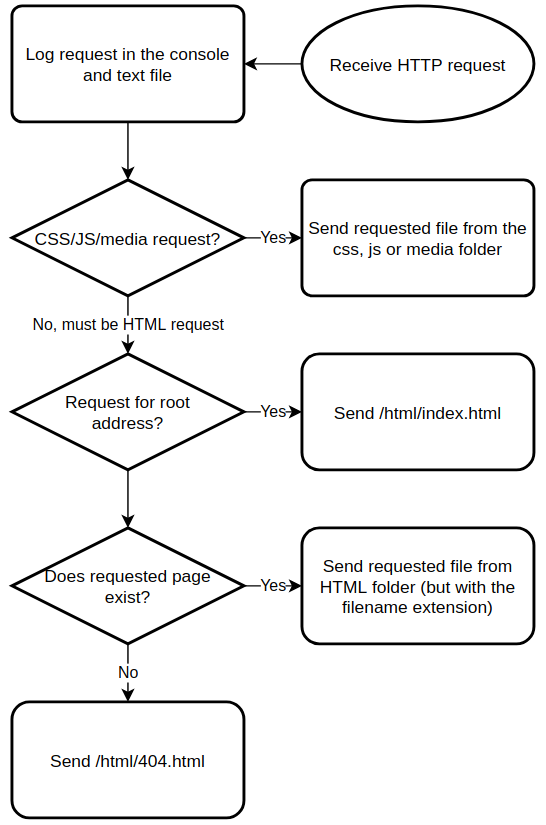

# NEA Project Design (Draft)

<address>
Jacob Halleron<br>The Sandon School
</address>


## Summary

As stated in the analysis document, the project will be a dynamic
website with a client-server model. On the server, there’ll be a NodeJS
app running the Express framework which will allow it to handle HTTP
requests asynchronously. On instance of a request, the server will
process it, and construct a webpage containing the relevant content. The
client side is a traditional setup written in HTML, CSS and JavaScript.
In essence, the browser will render a document with a diagram and the JS
runtime will simultaneously continuously edit parts of the page if the
correct buttons are selected.

In the “Proposed Solution” section of the analysis document, I’ve split
the development of the project into six stages and loosely modelled this
document around them. Some sections are much more complex and longer to
plan than others, so they will have more documentation.

External technologies I'll use:

- HTML&CSS
- Javascript (including the DOM, canvas and audio APIs)
- NodeJS
- Express web server
- EJS templating module, for dynamic pages
- Web browser
- Git & Github

## Server

The Express framework is a lightweight extension to the vanilla NodeJS
HTTP module, and it doesn’t add much other than make the server app
source code slightly simpler. I was originally going to use the Apache
web server with some basic templating coded in PHP, but my knowledge in
PHP is limited at best. I know JS much better. It would be faster and
more applicable to real life, though; most web servers have this setup
along with MySQL or something.

The server, along with the client, is written in JavaScript, and one can
define “routes” (responses triggered by requests to certain paths) in
the core \`app.js\` file. The program is completely event-driven, so one
need only define some functions, applicable to certain defined types of
request whose inputs and outputs are instances of request and response
objects (from the built-in classes).

The server will also log any requests it receives in the console and in a text file. Most web servers do this, it’s considered good
practice. I’ve put the whole server routing in a flow chart, shown in
the figure.



## File Structure

In traditional NodeJS fashion, all files can be found in one directory
hierarchy, shown here:

- `css`: Stylesheets.
- `html`: Contains all HTML pages, written with EJS syntax. From the “model” section of the analysis document.
	- `index.html`: Menu page.
	- `single.html`: Single simulation page.
	- `multiple.html`: Multiple simulations page.
	- `about.html`: About page.
	- `404.html`: 404 page if the user requests a resource that doesn’t exist.
- `js`: Contains all JavaScript code.
- `node_modules`: NPM (NodeJS package manager) automatically creates a
folder for any required modules the program uses. I won’t interact with
this directly.
- `package.json`: Another automatic NodeJS file, this one is a package
manifest – an “about” file - for my application.
- `app.js`: Core JS file for the server application. I’ll add the
“executable” flag in my filesystem so that I can my computer recognises
it as a program and I can directly run it instead of asking Node to
interpret it. I’ll do this using the `chmod +x` command.
- `README.md`: Git repositories prefer to have a readme”file to act as a
description of the project. This won’t be too large.

## Web Design

I’ll make the site look simple and high contrast. We’ll have a separate
light and dark mode using the CSS `prefers-color-sceme` variable.

\[write more after you do css\]

There will be a few pages to design:

- About (homepage)
- Menu
- Single animation page
- Multiple animation page
- 404 error page

I'll also have some HTML documents for the header and footer. These
won’t be accessible pages but they’ll be inserted in every page.

## Client Side JS

Most of the code in this project resides in the browser’s JavaScript
runtime.

Fundamental to this project is a box which shows the data structure
being focused on. It’ll be a completely resizeable canvas element and
look different depending on the type of object. The diagram inside it
will be either a bar chart (for sort and search algorithms) or a graph.
Every time the running algorithm changes some variable, the box will be
updated. Below are all the global variables I’m using in the script.

|Property|Type|Explanation|
|---|---|---|
|`actx`|Audio context|The “audio context”, or sound interface, I’ll use for any beeps and boops the program makes.|
|`GraphNode`|Class|Class for a single node of a graph. It has four properties: `id` which is a number unique to all the other nodes in a graph, `to` which is an array of the IDs of the other nodes it connects to, and `x` and `y` which are coordinates in the chart.|
|`TreeNode`|Subclass of `GraphNode`, specifically for a tree structure. Also has property `from` which is the ID of its parent.|
|`SortChart`|Class|Class for a numeric array chart|
|`GraphChart`|Class|Class for graph structure chart|
|`TreeChart`|Class|Class for a tree structure chart|
|`algos`|Map|Stores all algorithms any chart might use. Each one is represented as an object with two methods, one which executes at the start (`init`), and  one which executes every step after (`step`). The reasoning for this unorthodox algorithm representation will be explained later.|

This “visualiser” will be represented as a new object, of the `Visualiser` class. Because there may be multiple charts running, I could have multiple of these objects at a given time. Depending on the object it represents, there will be different child class. The properties of this parent class are shown below.

|Property|Type|Explanation|
|---|---|---|
|`draw`|Function|The method to draw the object to the respective canvas. This will be executed every frame when running and will be different for different subclasses.|
|`play`|Function|Starts algorithm loop using the built in `setInterval` function and stores the loop ID in `running`. Also starts the loop which triggers the draw function each frame.|
|`pause`|Function|Stops algorithm loop|
|`setAlgo`|Function|Changes the currently running function to the one with the given  name in the global `algos`.|
|`setSpeed`|Function|Stops the running algorithm and restarts with the given interval.|
|`reset`|Function|Stops the running algorithm and randomises `value` using an appropriate algorithm depending on the subclass.|
|`running`|Number|The ID of the function currently running on this chart. The `setInterval` function regularly executes a given function at a certain rate, and returns a unique number so  that this process can be cancelled.|
|`value`|Array or Tree|The most important property, the object being represented in the chart. For a bar chart this is a numeric array, for a graph or tree this is an array of nodes.|
|`shownValue`|Array or Tree|The value currently rendered in the actual chart; this may differ from `value` in the small time between the property access and drawing the frame. If `value` is too large this will not be used, for performance.|
|`algo`|String|Name of the current algorithm for this chart. This is also the key to find the relevant function in the global `algos` map.|
|`interval`|Number|Interval in milliseconds to wait between cycles of the algorithm.|

### Bar Chart

If an array of numbers is inputted, the function will draw a bar chart, with each item’s array index on the X-axis and its value on the Y-axis. There won’t be labels or axis lines though, they won’t be necessary to understand the process of the algorithm. Each bar will be coloured according to different factors, e.g. the currently scanned bar being red, recently moved ones being lighter than others, bars being green when sorted, etc. Underneath the bar chart may be one or more arrows to indicate certain variables related to the array in the running algorithm. The client machine will produce beep and boop sounds with pitch varying with the height of the bar being scanned.

This class of visualiser will have some of its own variables:

|Property|Type|Explanation|
|---|---|---|
|`swap`|Function|Swaps numbers at the two array index arguments|
|`setLength`|Function|Sets the length of the array.|
|`beep`|Function|Makes a beep sound with pitch corresponding to the inputted bar height. The pitch will probably be from around 125Hz to 8000Hz, as this is roughly the range a human can vocalise. Pitches will be distributed logarithmically using the in built mathematical module.|

The draw function will also be specific to this class. Rendering will be done by drawing rectangles on the canvas of uniform width, and height equal to that number’s index divided by the array length, multiplied by the canvas height. If the chart’s `interval` property is more than a certain amount of milliseconds, this function will utilise the `shownValue` property to create a short animation for any bars that have moved.

### Graph

Finally, if the input is a graph structure, a graph (in the technical mathematical sense) will be drawn on the canvas. A graph is effectively an array of nodes, with each node connected to others. I’ll make another class for a graph node:

|Property|Type|Explanation|
|---|---|---|
|`id`|String|The unique identifier of this node, also probably just one letter long.|
|`x`|Number|X coordinate of this node on the canvas.|
|`y`|Number|Y coordinate of this node on the canvas.|
|`to`|Array|Array containing the IDs of any other nodes this leads to.|

Graph drawing is a surprisingly wide branch of computer science, and the most popular method of formulating a diagram is through a method known as force directed graph drawing. Essentially, the system is simulated as if each vertex has forces applied to it that attract or repel connected vertices. After not too long, there is equilibrium. This technique is used by advanced and professional statistics software, so it might be overkill for the small examples in this project, but it looks fun to program so I’ll implement it. The algorithm, simplified and in pseudocode, is shown below:

```pseudocode
aaa
```

### Tree

If a tree object is inputted (a binary or nonbinary tree), a diagram with nodes and edges will be drawn in the box. A node will be a simple circle with a letter or number inside, and an edge will be a line. I’ll make a subclass of graph for it:

| Property   | Type     | Explanation                                                  |
| ---------- | -------- | ------------------------------------------------------------ |
| `id`       | String   | The unique identifier of this node, probably just one letter long. |
| `to`       | Array    | Array containing the IDs of any children nodes.              |
| `x`        | Number   | X coordinate of this node on the canvas.                     |
| `y`        | Number   | Y coordinate of this node on the canvas.                     |
| `mod`      | Number   | Used in the drawing algorithm to calculate how how much to modify its X coordinate. |
| `traverse` | Function | Accepts one argument, a string which is either “post” or “pre”. Returns an array of the values of the appropriate traversal of this node and its children. In order traversal will only be possible for binary trees, which this may not be. |

The Y position of a given node will depend on its depth in the tree, i.e. the root node goes at the top and the deepest leaf at the bottom, with nodes with equal depth having equal Y positions The X position, however, will be more tricky to calculate; I’ll want parent nodes centered above their children (so there aren’t more nodes under one side than the other) and all the nodes relatively evenly distributed so that we don’t waste space on the screen or cram too many into a small space. This isn’t *technically* necessary, but will make the diagram more aesthetically pleasing and easier for the user to scan, thereby improving the user experience. [This](https://rachel53461.wordpress.com/2014/04/20/algorithm-for-drawing-trees/) article and its attached source code have been especially useful for the tree-drawing process, and I’ll be using an algorithm similar to the one provided in it. It involves initially spacing the children apart, then centering the parents over them, then making sure there are no collisions in their positions. Here’s its pseudocode, it’s surprisingly lengthy:

```pseudocode
function calculateInitialX(tree):
	for child in tree.children:
		calculateInitialX(child)
	if tree has left siblings:
		tree.x = tree.leftSibling.x + 1
	if tree has no children:
		tree.x = 0
	if tree has 1 child:
		if tree has left siblings:
			tree.mod = tree.x – tree.children[0].x
		else:
			tree.x = tree.children[0].x
	if tree has multiple children:
		mid = (tree.children[0].x + tree.children[last].x) / 2
		if tree has left siblings:
			tree.mod = tree.x - mid
		else:
			tree.x = mid
	if tree has children and left siblings:
		conflictCheck(tree)

function conflictCheck(tree):
	# mindistance = 1
	shiftValue = 0
	contour = getLeftContour(tree) # minimum x value of children
	sibling = tree.leftmostSibling
	while sibling exists and is not tree:
		siblingContour = getRightContour(sibling)
		for level = tree.y to minimum(contour.keys):
			if (contour[level] - siblingContour[level]) < shiftValue
				shiftValue = 1 – distance
		if shiftValue > 0:
			tree.x += shiftValue
			tree.mod += shiftValue
			centerNodesBetween(tree, sibling)
			shiftValue = 0
		sibling = sibling.rightSibling

function calculateFinalPositions(tree):
	tree.x += tree.mod
	for child in tree.children:
		calculateFinalPositions(child)
```

As with the bar and graph charts, I’ll make another subclass for the tree chart:

| Property      | Type   | Explanation                                                  |
| ------------- | ------ | ------------------------------------------------------------ |
| `height`      | Number | How many nodes tall (deep) the tree will be after generation. |
| `maxChildren` | Number | The maximum number of children a node can have for generation. |

### Algorithms

The algorithms themselves will not be as simple as rewriting pseudocode from the internet. Integral to the design of the site is the ability to start and stop the algorithm at will, and change the speed it runs. JavaScript only has functionality to execute statements at the maximum speed possible, or trigger a function regularly at a set interval. The simplest solution I can think of is to convert all the code into a function that will repetitively be executed for every step of the process. Each algorithm will be represented as one function that is only applied at the start, and another which is executed for every step of the process.

All the algorithms contain either a while loop or a for loop, and these aren’t too complex to convert to my single function format. Here are some pseudocode examples:

While loop:

```
if foo:
	bar()
else:
	break()
```

For loop:

```
i = 0 // in the init function
if i < foo:
	bar()
	i++
else:
	break
```

The algorithms I’ll implement are listed below:

Bar chart:
- Bubble
- Bogo
- Insertion
- Selection
- Merge
- Quick

- Linear search
- Binary search

Tree:

- Pre order
- In order

- Post order
- Binary search

Graph:

- Depth first search
- Breadth first search

- Dijkstra
- A*

